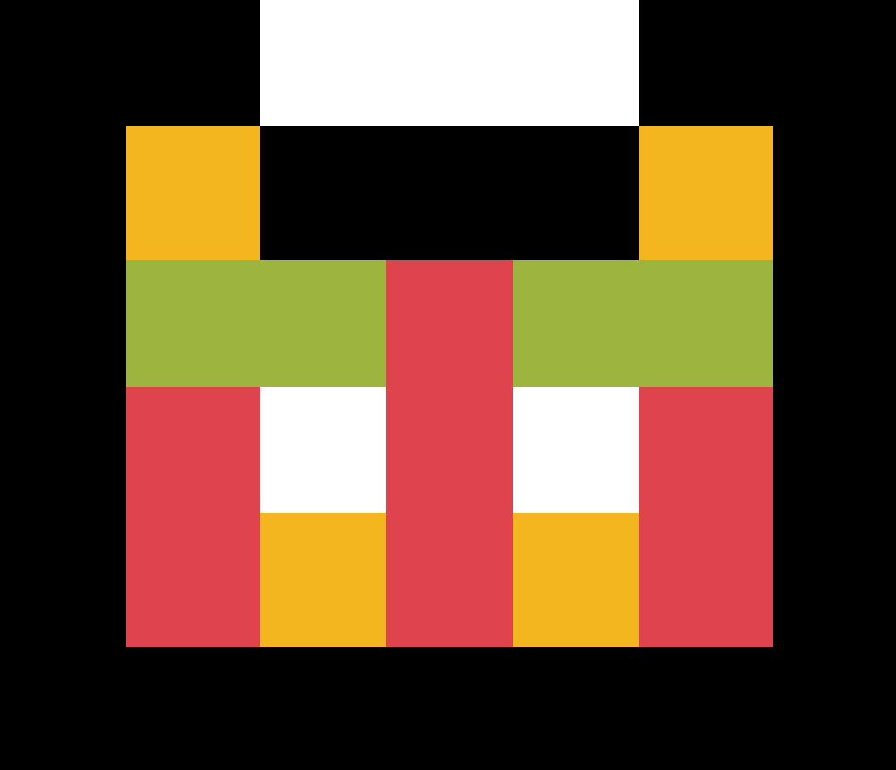

<p align="left">
  
</p>

# Tear
Tear is a Rust library that enables you to create your own fantasy console using winit and pixels.

## Quick Example ⚡

```rust
use tear::*;

struct World;

fn main() {
    let world = World {};

    Tear::new(
        "Tear render",
        Point::new(300, 300), 
        Point::new(128, 128)
    ).build(world);
}

impl State for World {
    fn draw(&mut self, gpu: &mut Gpu, buffer: &mut [u8]) {
        
    }

    fn update(&mut self) {
        
    }

    fn input(&mut self, input: &mut Input) {
        
    }
}
```

## ATTENTION ⚠
- **Unstable code:** The code cannot be fully optimized.
- **Missing functions:** You can draw pixels, rectangles and lines on the screen, but for now you cannot draw images, sounds and music.

## API
- ## How Create Window:
  Use the "new()" function of the "Tear" structure to create a window, the first parameter is the window name, the second is the window size, and the third is buffer size. To   compile everything use the "build(world)" function and insert a structure that implements the trait state to compile everything:
  
  ```rust
  use tear::*;
  
  struct World;
  
  fn main() {
      let world = World {};
  
      Tear::new(
          "Tear render",
          Point::new(300, 300), 
          Point::new(128, 128)
      ).build(world);
  }
  
  impl State for World {
      fn draw(&mut self, gpu: &mut Gpu, buffer: &mut [u8]) {
          
      }
  
      fn update(&mut self) {
          
      }
  
      fn input(&mut self, input: &mut Input) {
          
      }
  }
  ```
  
- ## How to draw a rectangle on the screen:
  Go to the "draw" function of your structure that implements the "state" trait like we did before and write this:
  ```rust
  gpu.render_rect(buffer, &mut Rect::new(0, 0, 100, 100), BLUE, true);
  ```
  The first   parameter indicates where to draw the rectangle, in the second you must insert the rect structure which has x, y and width, height as parameters, while in the third parameter   there is the color and in the last you choose whether or not to make it exit the screen

  ```rust
    // Draw fn
    fn draw(&mut self, gpu: &mut Gpu, buffer: &mut [u8]) {
        // Draw rect
        gpu.render_rect(
            // buffer to draw rect
            buffer, 
            // &mut Rect struct 
            &mut Rect::new(0, 0, 100, 100), 
            // Color
            BLUE, 
            // Don't let it go off the screen
            true
        );

    }
  ```
  
- Coming soon...
